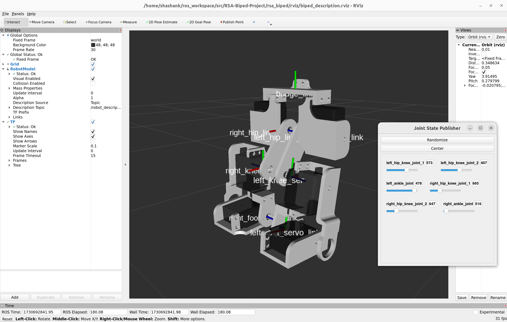

# RSA-Biped-Project

Project Proposal for Arduino-Controlled Biped Robot with IMU and Ultrasonic Sensors.

**Project Overview:**
This project focuses on designing an Arduino-controlled biped robot capable of stable walking. The robot will integrate an IMU (Inertial Measurement Unit) for balance control and an ultrasonic sensor for obstacle detection in its walking path. The goal is to develop a functional bipedal movement system, emphasizing sensor integration to ensure stability and responsiveness to the environment.

**Objectives:**

1. **Walking Mechanism:** Enable stable and controlled walking using servomotors to simulate leg movements.
2. **Balance and Stability:** Utilize the IMU sensor (accelerometer and gyroscope) to detect any tilt or instability, allowing the robot to make real-time adjustments for balance.
3. **Obstacle Detection:** Implement an ultrasonic sensor to detect obstacles in the robot’s path and stop or adjust its walking pattern to avoid collisions.

**Components:**

1. **Microcontroller:** Arduino Mega to manage sensor input and actuator control.
2. **Sensors:**
    - **MPU6050 IMU (Accelerometer/Gyroscope):** Provides data on the robot’s orientation, allowing for balance corrections.
    - **HC-SR04 Ultrasonic Sensor:** Detects objects within a predefined range to prevent collisions.
3. **Actuators:**
    - **MG995 Servomotors:** Control leg movement and enable a steady walking pattern.

**System Design:**

1. **Walking Control:**
    - The servomotors are programmed to mimic a walking gait, alternating leg movements to achieve forward motion.
2. **Balance Maintenance:**
    - The IMU sensor continuously monitors the robot's orientation. If the robot starts to tilt, the Arduino adjusts the servomotors to re-balance the biped.
3. **Obstacle Detection:**
    - The ultrasonic sensor scans the area directly in front of the robot. If an obstacle is detected within a safe distance, the robot pauses or adjusts its movement to avoid a collision.

**User Interaction:**
The robot can be started visualized in RViz, a 3D visualization tool for ROS. The user can observe the robot's movement, balance adjustments in real-time.
